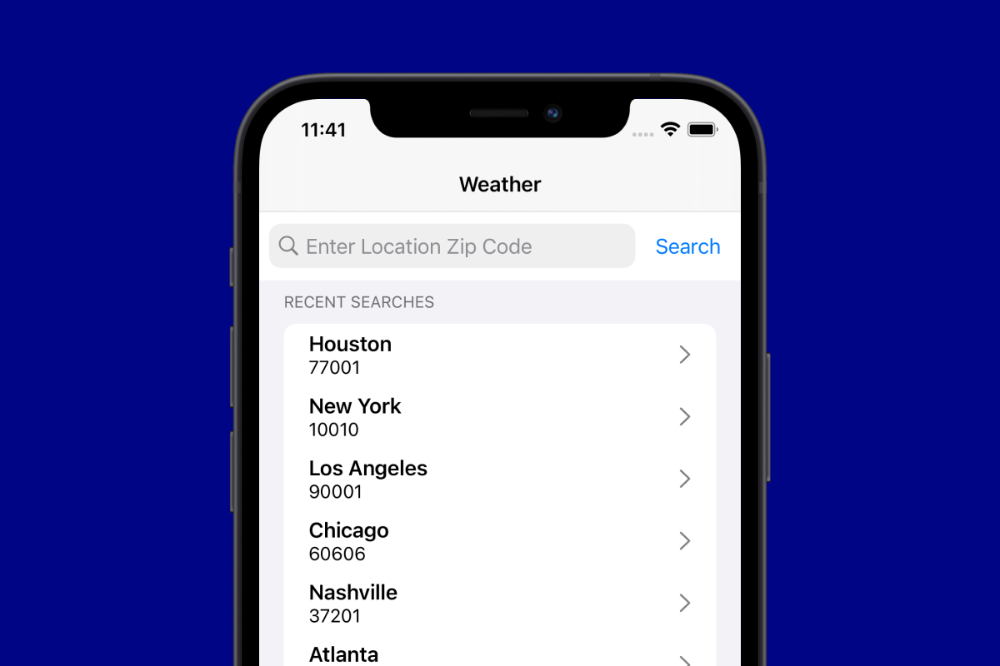
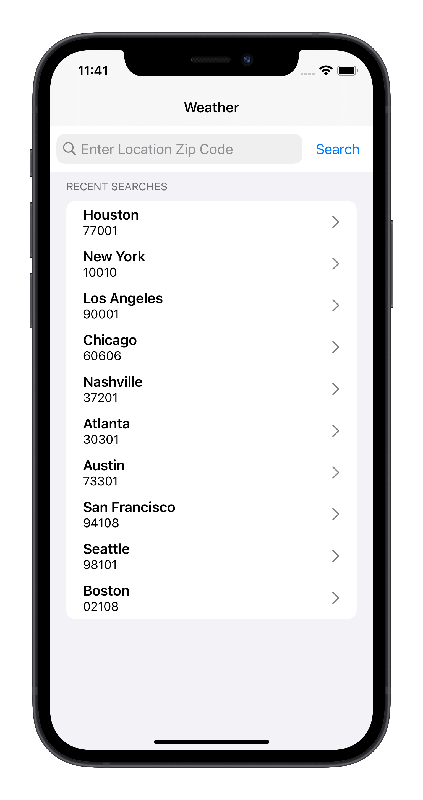
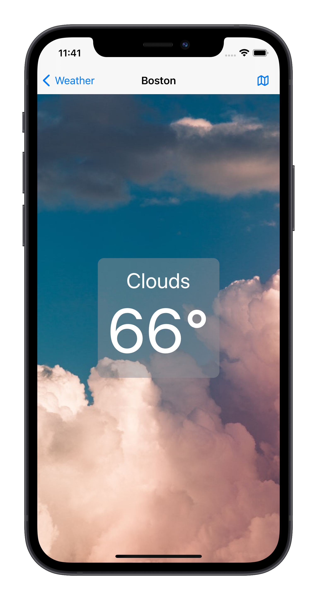
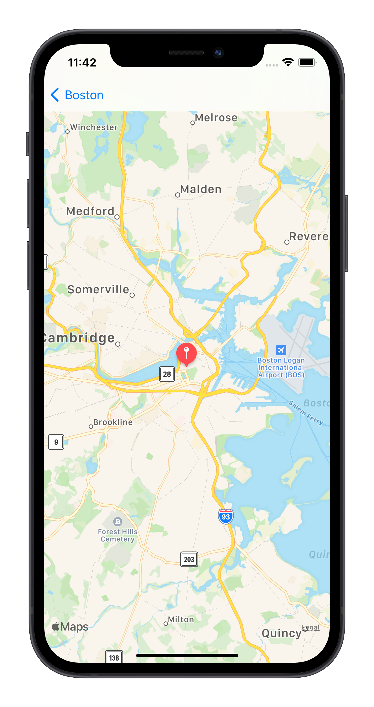
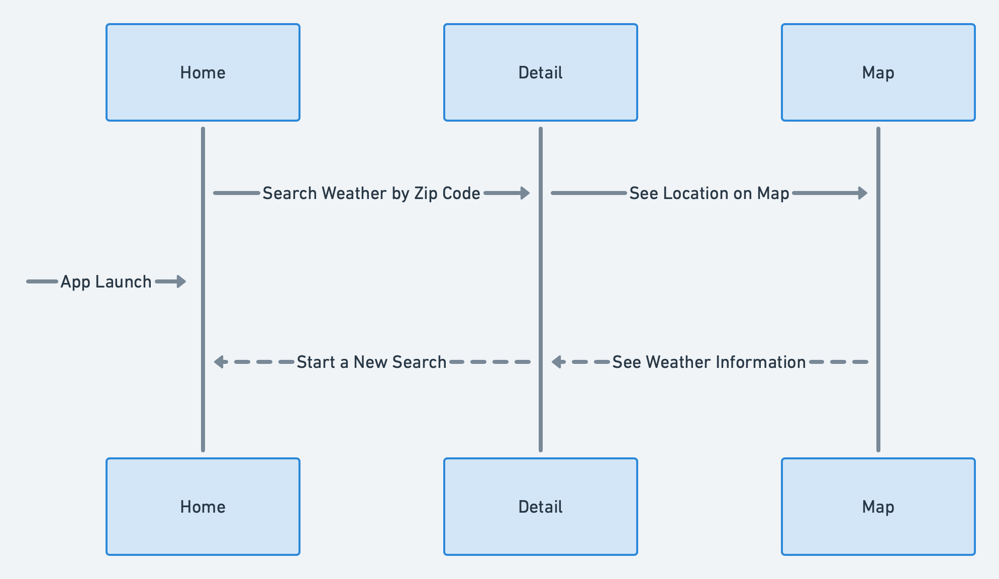

# Building a SwiftUI Weather App with Lasso, Part 1: Setup



As SwiftUI matures and becomes increasingly considered for production implementation, it's important to add interoperability support in UIKit iOS applications. As a result, WW has added SwiftUI support when using its open-source architectural framework, [Lasso](https://github.com/ww-tech/lasso).

This is WW Tech’s first tutorial to demonstrate the use of Lasso with SwiftUI. For demonstrative purposes, I will outline the steps to build a small weather app using Lasso and SwiftUI.

If you're unfamiliar with Lasso, be sure to check out these WW Tech articles that introduce Lasso concepts and the corresponding documentation.

- [Lasso: Introducing a new architectural framework for iOS](https://medium.com/ww-tech-blog/lasso-introducing-a-new-architectural-framework-for-ios-360da7546df9)
- [Lasso: An introduction to Flows](https://medium.com/ww-tech-blog/lasso-an-introduction-to-flows-959050b78cee)
- [Lasso documentation](https://github.com/ww-tech/lasso/tree/develop/docs)

> This article assumes some knowledge of SwiftUI. As a result, this article excludes parts of the code and does not explain SwiftUI concepts; instead, this focuses on Lasso concepts and changes.

## Using Lasso and SwiftUI Together

Before we get started, let's take a moment to understand how Lasso and SwiftUI fit together. 

When choosing an app architecture, it's important to make considerations about scalability, maintainability, and overall structure. The Lasso architectural pattern provides many benefits when incorporating SwiftUI into predominantly UIKit apps. Here are some of the continued benefits that the Lasso framework provides when using SwiftUI:

- SwiftUI can be used for the `View` portion of a Lasso `Screen`.
- The SwiftUI `View` is wrapped by a `UIHostingViewController`.
- `Screen` is still a unidirectional data flow paradigm.
- All logic is still in the `Store`.
- `View` still dispatches actions to the `Store`.
- `View` still observes the `State` and updates the `View` accordingly.
- `Flow` still handles all `Screen` interoperation.

## What we'll build

Home Screen |  Detail Screen |  Map Screen            
:--------------------:|:--------------------:|:--------------------:
 |  | 

As we go through this tutorial, be sure to follow along with the original project source code to add the necessary code blocks and files.

## Creating the project

Start by creating a new iOS application, similar to any other iOS application, by opening Xcode.

1. Choose **Create a new Xcode Project**, then **iOS**, then **App**.
2. Select **SwiftUI** as the interface and **UIKit App Delegate** as the project’s life cycle.
3. As an optional step, you can select **Include Tests**.

> It's important to select a **UIKit App Delegate** for the project life cycle. At this time, Lasso still uses UIKit components, such as a `UINavigationController`, to handle navigation.

## Adding Lasso

To add Lasso to an iOS project, you can use [Swift Package Manager](https://swift.org/package-manager/) or [Cocoapods](https://cocoapods.org/). For this project, we'll use the former. Follow these steps to add Lasso as a dependency:

1. Choose **File**, then **Swift Packages**, then **Add Package Dependency**.
2. Use the following Git URL: https://github.com/ww-tech/lasso.git.
3. Select the **feature/swiftui** branch to update the Swift Package.
4. Add **Lasso** to your project's main target.
5. As an optional step, add **LassoTestUtilities** to your project's unit testing target.

> Currently, the SwiftUI updates to Lasso are on a feature branch named `feature/swiftui`. Soon, `develop` will merge in this feature branch.

## OpenWeather API setup

For this project, we'll be using a RESTful API by [OpenWeather&reg;](https://openweathermap.org/) to get weather data. This API helps demonstrate networking in a SwiftUI and Lasso app. To use this third-party service, you'll need to create a free account and a free API key. For help using OpenWeather, be sure to check out their [FAQs page](https://openweathermap.org/faq).

After you set up an API key with OpenWeather, make sure to replace `YOUR_API_KEY_HERE` in the file named `WeatherService.swift` included in the project source code.

> Disclaimer: In this example, we will be hard coding an API key into the application’s source code. **This is not something that is recommended for production systems** and is being done only for simplicity within this example. In a production scenario, this call would be proxied through your own API/microservice in order to protect the API key from being visible to anyone using the client-side application.

## Creating the data model

Like any other iOS project, you'll need to create a data model to represent the raw data returned by the API. By reviewing the API documentation, you'll see sample JSON responses that represent the data model shape.

The key takeaway here is that the data model must conform to `Equatable`. Lasso requires that all `State` properties conform to `Equatable`.

> Note: `State` is defined in Lasso and is not the `@State` property wrapper in SwiftUI.

```swift
// Weather.swift

struct Weather: Decodable, Equatable {
    let coordinates: Coordinates
    let weatherElement: [WeatherElement]
    let base: String
    let main: MainWeather
    ...
    enum CodingKeys: String, CodingKey {
        case coordinates = "coord"
        case weatherElement = "weather"
        case base
        case main
        ...
    }
}
```

## Creating the API service
Next, we'll implement the API service calls. For this, we'll use Apple’s Combine framework to leverage  `AnyPublisher`. This will allow us to easily fetch weather data when a user selects a previous search from a list of recent searches or enters a new zip code.

```swift
// WeatherService.swift

func getCurrentWeather(zipCode: String,
     countryCode: String = "US") -> AnyPublisher<Weather, Error> {
   let url = constructAPIURL(zipCode: zipCode, countryCode: countryCode)!
   
   return urlSession.dataTaskPublisher(for: url)
      .tryMap({ (data: Data, response: URLResponse) in
         guard let response = response as? HTTPURLResponse else {
            throw WeatherError.unknown
         }
         switch response.statusCode {
         case 200...299: return data
         case 404: throw WeatherError.cityNotFound
         case 500...599: throw WeatherError.serverError
         default: throw WeatherError.unknown
         }
      })
      .mapError { $0 as Error }
      .decode(type: Weather.self, decoder: JSONDecoder())
      .eraseToAnyPublisher()
}
```
## Creating the Lasso `ScreenModule`s

We'll create two `ScreenModule`s for this project, one for the Home screen and one for the Detail screen (see “What we’ll build,” above). Each `ScreenModule` will hold the `State`, `Action`s, and `Output`s of our sample application. To learn more about Lasso `ScreenModule`s, be sure to check out [this guide](https://github.com/ww-tech/lasso/blob/develop/docs/Lasso-Introduction-part1.md).

As an example, here's what the Home `ScreenModule` should look like.

```swift
// HomeScreen.swift

enum HomeScreen: ScreenModule {

    struct State: Equatable {
        var isSearching: Bool = false
        var searchError: WeatherError? = nil
        var isValidZipCode = false
        var searchZipCode: String = ""
        var recentSearches: [RecentSearch] = RecentSearch.load()
    }

    enum Action: Equatable {
        case didEditZipCode(String)
        case didTapSearch
        case didDismissErrorAlert
        case didTapRecentSearch(RecentSearch)
        case didDeleteRecentSearch(indexSet: IndexSet)
    }

    enum Output: Equatable {
        case showDetail(_ weather: Weather)
    }

    static var defaultInitialState: State { State() }

    static func createScreen(with store: HomeScreenStore) -> Screen {
        let homeView = WeatherHomeView(store: store.asViewStore())
        return Screen(store, homeView)
    }
}

```

You'll notice that the process of declaring a `ScreenModule` when using SwiftUI is nearly the same as when using UIKit. We can still override the `State`, `Action`, and `Output` of a `ScreenModule`, and we still need to define a `defaultInitialState`. One slight difference is how we define `createScreen`. Instead of passing a `ViewStore` into a `ViewController`, we're passing it into the constructor of a SwiftUI `View`. After that, we pass the SwiftUI `View` into the `Screen` constructor. For convenience, Lasso will later wrap it as a `UIHostingController` to eliminate this repetitive step.

The definition of the Detail `ScreenModule` follows a very similar structure and process as Home. The only difference is that `State`, `Action`, and `Output` remove logic specific to Home and add logic specific to Detail. 

## Creating the `LassoStore`s

Next, we'll create a `LassoStore` that will handle the business logic associated with the `Action`s of each respective `ScreenModule`. Following the previous section, let's take a look at Home's `LassoStore`.

```swift
// HomeScreenStore.swift

final class HomeScreenStore: LassoStore<HomeScreen> {
    private let weatherService: WeatherService
    private var weatherServiceCancellable: AnyCancellable?

    init(weatherService: WeatherService) {
        self.weatherService = weatherService
        super.init(with: LassoStore<HomeScreen>.State())
    }

    required init(with initialState: LassoStore<HomeScreen>.State) {
        self.weatherService = WeatherService()
        super.init(with: initialState)
    }

    override func handleAction(_ action: LassoStore<HomeScreen>.Action) {
        switch action {
        case .didEditZipCode(let zipCode):
            ...
        case .didTapSearch:
            ...
        case .didDismissErrorAlert:
            ...
        case .didTapRecentSearch(let recentSearch):
            ...
        case .didDeleteRecentSearch(let indexSet):
            ...
        }
    }

    ...
}
```

Later in this tutorial, we'll connect our SwiftUI `View`s to this `LassoStore`. When using SwiftUI components, such as `Button` or `TextField`, the logic in `handleAction` will execute for the specified action and interaction. For example, we'll set the `onCommit` property of the Home search bar (a SwiftUI `TextField`) to execute the `didEditZipCode(String)` action. 

As a general note, we're passing a `WeatherService` object into the `HomeScreenStore` constructor. For better testability, we can later change this to a protocol, such as `WeatherFetchable`, to easily unit test this `LassoStore`.

## Creating the Lasso `Flow`

We'll now give a navigation structure to our app using a `Flow`.




Looking at the diagram, you'll see three main screens: **Home**, **Detail**, and **Map**. You'll also note that `Home` is the entry point of the app. From the screenshots at the top, you might also notice that the app leverages a navigation stack to push views onto the view hierarchy.

We'll first start by defining a basic `Flow`. Note that `NoOutputNavigationFlow` is a basic `FlowModule` that specifies no `Output` and requires placement in a `UINavigationController`.

```swift
// WeatherFlow.swift

final class WeatherFlow: Flow<NoOutputNavigationFlow> {
   ...
}
```

Next, we'll override the `createInitialController` method of our `Flow`.

```swift
override func createInitialController() -> UIViewController {
    HomeScreen
        .createScreen()
        .observeOutput { [weak self] in self?.handleHomeScreenOutput($0) }
        .controller
}

// MARK: - Home Screen

private func handleHomeScreenOutput(_ output: HomeScreen.Output) {
    switch output {
    case .showDetail(let weather):
        createDetailController(with: weather)
            .place(with: nextPushedInFlow)
    }
}
```

Recalling from a previous step, `HomeScreen` defines its `createScreen` method with a SwiftUI `View`. What you'll notice, though, is the implementation of a `Flow` remains virtually the same when using SwiftUI instead of UIKit. The `controller` property intelligently wraps our SwiftUI `View` in a `UIHostingController` allowing for easy interoperability with an existing `Flow`, while adhering to the required `UIViewController` return type.

One important note is that the Map section of this app does not have a `ScreenModule` or a `LassoStore`. Instead, it uses `UIViewRepresentable` to wrap an `MKMapView` with the coordinates of our search location. As a result, the implementation of our `Flow` when navigating to the map changes.

```swift
// WeatherFlow.swift 

private func handleDetailScreenOutput(_ output: DetailScreen.Output) {
    switch output {
    case .didTapMap(let coordinates):
        createMapController(coordinates: coordinates)
            .place(with: nextPushedInFlow)
    }
}

// MARK: - Map Screen

private func createMapController(coordinates: Weather.Coordinates) -> UIViewController {
    let mapView = MapView(coordinates: coordinates).edgesIgnoringSafeArea(.all)
    return UIHostingController(rootView: mapView)
}
```

Here, we'll have to handle more of the implementation details. First, we'll instantiate a `MapView` in our `createMapController` method. Additionally, we'll add the `.edgesIgnoringSafeArea(.all)` view modifier to fill the available space. Unlike the process earlier, we'll have to manually wrap this `View` with a `UIHostingController` and set it as the root view. We do this to keep the UIKit navigation pattern, allowing our `Flow` to handle the logic associated with pushing and popping this screen onto and off the navigation stack as a `UIViewController`. 


## Recap

Up to this point, much of Lasso has remained the same for our SwiftUI app. We still have the main components of Lasso: `Flow`, `FlowModule`, `ScreenModule`, and `LassoStore`. 

However, some differences have already been introduced. We're now using `UIHostingController` to wrap our SwiftUI `View`s as `UIViewController`s.

You'll also notice that we're not using many common property wrappers, such as `@Published`. That's because we'll leverage the power of Lasso to handle all state management logic.

In [Part 2](Part-2-Adding-Views.md) of this tutorial, we’ll learn how to finally add this into our SwiftUI project and implement the SwiftUI `View`s.


## Metadata

Author: Charles Pisciotta, iOS Engineering Intern<br>
Created: October 2021<br>
Last Updated: October 2021


## Notes

Are you interested in joining the WW team? Check out the [careers page](https://www.weightwatchers.com/us/ww-corporate-careers) to view technology job listings as well as open positions on other teams.

OpenWeather provides the weather data in this app. WW is not affiliated with or sponsored by OpenWeather, nor is WW a sponsor of OpenWeather. OpenWeather is used exclusively for demonstrative purposes.

