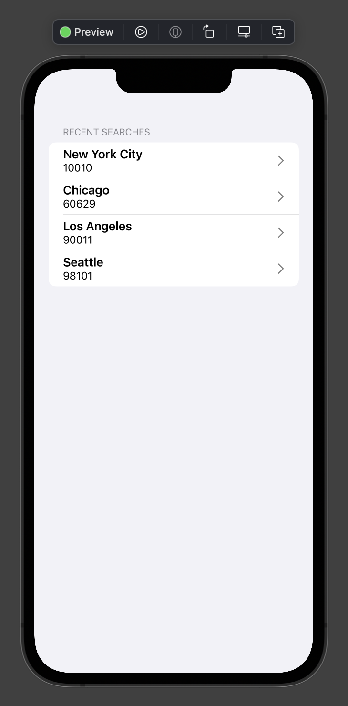

# Building a SwiftUI Weather App with Lasso, Part 2: Adding the SwiftUI Views


In Part 1 of this tutorial, we set up the API and the Lasso building blocks for our SwiftUI app. If you didn't read the first article in this series, be sure to check it out [here](Part-1-Setup.md).

Now comes the next step: implementing SwiftUI `View`s with Lasso. In this part, we'll implement the Home screen to illustrate key Lasso concepts when using SwiftUI. To see the implementation of the Detail and Map screens, be sure to review the source code.

If you're unfamiliar with Lasso, see the documentation and WW Tech articles that introduce Lasso concepts.

- [Lasso: Introducing a new architectural framework for iOS](https://medium.com/ww-tech-blog/lasso-introducing-a-new-architectural-framework-for-ios-360da7546df9)
- [Lasso: An introduction to Flows](https://medium.com/ww-tech-blog/lasso-an-introduction-to-flows-959050b78cee)
- [Lasso documentation](https://github.com/ww-tech/lasso/tree/develop/docs)

> This article assumes some knowledge of SwiftUI. As a result, this article excludes parts of the code and does not explain SwiftUI concepts; instead, this focuses on Lasso concepts and changes.

As we go through this tutorial, be sure to follow along with the original project source code to add the necessary code blocks and files.

## Defining a Screen

If you're familiar with SwiftUI, you know that a `View` can be as small as an icon and as large as an infinitely scrolling list. As a result, Lasso defines a `Screen` as a `View` that is not the child of a parent `View`—for example, a home screen, a profile screen, a modal sheet, etc. 

In this sample application, we have three `Screen`s: Home, Detail, and Map. Each has child `View`s, but each is not a child of any higher-level `View`.

We'll start by creating the Home screen. This will serve as the entry point of our app where users can search by zip code or select a recently searched city. To configure this screen, we'll conform `WeatherHomeView` to `LassoView`. 

```swift
// WeatherHomeView.swift

struct WeatherHomeView: View, LassoView {
    @ObservedObject private(set) var store: HomeScreen.ViewStore

    var body: some View {
        ...
    }
}
```

Let's take a look at the `LassoView` protocol.

```swift
// Screen.swift

public protocol LassoView {
    associatedtype ViewState
    associatedtype ViewAction
    typealias ViewStore = AnyViewStore<ViewState, ViewAction>
    var store: ViewStore { get }
}
```

You'll notice there is one requirement: A `LassoView` must have a `ViewStore` property called `store`. The high-level views must conform to `LassoView` to leverage `static func createScreen(with store: ConcreteStore) -> Screen` when using a `ScreenModule`. This function wraps a SwiftUI `View` in a `UIHostingController` under the hood.

> The `store` property automatically conforms to `ObservableObject`. This conformance allows us to use the `@ObservedObject` property wrapper, which automatically re-renders a SwiftUI `View` when state changes occur.

## Implementing the View

Next, we'll begin implementing the components of our Home screen using SwiftUI. Before we do that, let's take a look at the Home screen and remind ourselves of the major screen components.


The screenshot shows roughly three major components to our Home screen: a navigation bar title, a search bar, and a recent searches list. To further modularize this screen, we'll extract the content of the list as a recent search row.

## Recent search row
We'll start by writing the list row component to display a recent search. To do this, we'll create a `View` that accepts a `RecentSearch` data model instance. Using this data model, we'll design a UI component with native SwiftUI components, such as `VStack` and `Text`, to display the city name and zip code from the search instance. 

```swift
// RecentSearchPreview.swift

struct RecentSearchPreview: View {
    let recentSearch: RecentSearch

    var body: some View {
        VStack(alignment: .leading) {
            Text(recentSearch.cityName)
                .font(.headline)

            Text(recentSearch.zipCode)
                .font(.subheadline)
        }
    }
}
```

> You can see `RecentSearchPreview` doesn't conform to `LassoView` because this `View` is not considered a `Screen` and does not have any `ObservedObject`s.

Later, we'll wrap this UI component with a `NavigationRow`, a custom UI component that accepts the view's `ViewStore` and an `Action` value.

```swift
// WeatherHomeView.swift
private func recentSearchRow(for recentSearch: RecentSearch) -> some View {
    NavigationRow(store, action: .didTapRecentSearch(recentSearch)) {
        RecentSearchPreview(recentSearch: recentSearch)
    }
}
```

Leveraging Xcode's [Preview Canvas](https://developer.apple.com/documentation/swiftui/previews-in-xcode?changes=_2), we can preview our UI implementation in Xcode—without running the simulator—using mock data. Here is a screenshot of our current implementation.


## Recent search list
Next we'll build on our recent search row component by implementing the recent searches list. To accomplish this, we'll use the following SwiftUI components:

- `List`: The foundational UI component that arranges our data and rows.
- `Section`: This will group our recent search rows and a header title.
- `ForEach`: This iterates over an `Identifiable` collection and returns a `View`.
- `onDelete`: A `ViewModifier` that executes our `ViewStore`'s logic when the user swipes to delete a row.
- `listStyle`: A native `ViewModifier` that customizes our `List`'s appearance.

```swift
// WeatherHomeView.swift

List {
    Section(header: Text("Recent Searches")) {
        ForEach(state.recentSearches, content: recentSearchRow)
            .onDelete(store) { .didDeleteRecentSearch(indexSet: $0) }
    }
}
.listStyle(InsetGroupedListStyle())
```

You can see how only a few lines of code are required to build a list in SwiftUI in comparison to UIKit; more importantly, note how easily Lasso fits into building these common components.

Using Xcode's Preview Canvas, let's take a look at the newly implemented `List`. To do this, we can override the `State` of our `HomeScreenStore` with mock `RecentSearch` values.



## Creating the search bar with a SwiftUI Binding
When implementing our home screen's search bar, we'll need to use a SwiftUI `Binding` to observe changes to the search bar text. If you've used SwiftUI before, you're probably used to the `$` prefix syntax when creating a `Binding`. This allows for easy read-and-write access on state values. For example, you might have a SwiftUI `View` that looks like this:

```swift
// Traditional SwiftUI Binding

@ObservedObject var vm: SearchViewModel

var body: some View {
    SearchBar(placeholder: "Search Here!", text: $vm.searchText)
}
```

At this point, you can't leverage that syntax when using Lasso. Lasso's read-only restriction on `State` prevents this behavior. As a result, you'll have to set up your `Binding` with a bit more code when creating the search bar. For example, you might set up your search bar `Binding` like this:

```swift
// Lasso + SwiftUI Binding

@ObservedObject private(set) var store: HomeScreen.ViewStore

// 1
private func searchBarBindingAction(newZipCode: String) -> WeatherHomeViewModule.ViewAction {
    .didEditZipCode(newZipCode)
}

private var locationSearchBar: some View {
    // 2
    let searchBinding = store.binding(\.searchZipCode, action: searchBarBindingAction)

    // 3
    return SearchBar(placeholder: "Search Here!", text: searchBinding)
}
```

Let's take a look at each of the steps involved.

1. First, we'll create a function that accepts a parameter matching the `Binding`'s wrapped type. This function will return an `Action` from `store` that will update the appropriate `State` properties in the `LassoStore` by calling `update`.
2. Next, we'll create a `Binding` using the `binding` method. This uses a `WritableKeyPath` on the `State` to determine which property to observe. Then we'll pass in our function from step 1, which matches the input and output of the `action` parameter.
3. Last, we'll continue implementing SwiftUI components as usual. The only difference is that we exclude the `$` prefix because we created a `Binding` directly.

> You must implement the `update` logic in your `LassoStore` with the corresponding `Action` to update values appropriately. Otherwise, your `State` property will remain constant.

## Putting it all together

Consistent with the screenshot of our app, we've implemented nearly every component of our home screen. The last step that remains is to put them all together and add our navigation bar title to the `Screen`. Realizing that our components align vertically, we'll use a `VStack` to build the `Screen`.

```swift
// WeatherHomeView.swift

var body: some View {
    VStack(spacing: 0) {
        // 2. Search Bar
        locationSearchBar

        // 3. Recent Searches List
        List {
            Section(header: Text("Recent Searches")) {
                // 4. Recent Search Row
                ForEach(state.recentSearches, content: recentSearchRow)
                    .onDelete(store) { .didDeleteRecentSearch(indexSet: $0) }
            }
        }
        .listStyle(InsetGroupedListStyle())
    }
    .navigationBarTitle("Weather") // 1. Navigation Bar Title
    .alert(item: searchErrorBinding, content: searchErrorAlert)
    .onTapGesture(perform: KeyboardManager.hideKeyboard)
    .overlay(loadingView)
}
```

Looking at this implementation, let's highlight a few important facts.

- **Navigation** You'll see right away that we're defining the navigation bar title without embedding the root view in a `NavigationView`. That's because our Lasso `Flow` is handling the navigation stack for us. You must omit `NavigationView` too.
- **Bindings** If you're familiar with SwiftUI, you've probably used `Binding`s to handle changes to state properties. With Lasso, `State` properties are read-only. This prevents the traditional `$` syntax that is normally used with native SwiftUI components, such as `Alert` and `TextField`. As a work-around, Lasso provides a `binding` method on the `store` property.
- **View methods** Many SwiftUI components have methods such as `onTapGesture`, `onAppear`, etc. In our case, the list elements are using the `onDelete` modifier. Many of these methods allow you to execute logic when appropriate. Looking at our project’s source code, you'll see that Lasso extends many of these methods to accept the view's `ViewStore` and an `Action` value—keeping the business logic in the `LassoStore`.

Using Xcode's Preview Canvas one final time, we can see that our Home screen is complete.


> Our navigation bar title doesn't appear in the preview because our preview instance is not embedded by a `NavigationView`.

## Checking in

At this point, we’ve implemented the Home screen of our app. We’ve built the user interface using small reusable components. Additionally, we’ve maintained separation of concerns by isolating the business logic in a `LassoStore`. Most importantly, we’ve demonstrated the ability to build a scalable app with Lasso and SwiftUI.

When implementing the Detail screen, we can follow a process similar to the one we followed for the Home screen. When implementing the Map screen, the project follows a slightly different process by using `UIViewRepresentable` as a wrapper around a UIKit `MKMapView` component. To learn more about `UIViewRepresentable`, check out Apple’s documentation [here](https://developer.apple.com/documentation/swiftui/uiviewrepresentable) and see this project’s implementation in the file named `MKMapView+SwiftUI.swift`. Regardless, be sure to check out the project’s source code to learn more about the remaining implementation details.

In the rest of this article, we’ll focus on some of the features that Lasso introduces to support SwiftUI, such as wrappers around native SwiftUI components and `View` methods. Additionally, we’ll consider the need for a Lasso `StoreModule` in a SwiftUI application and how we might implement one in an app. 

## Using Lasso's extended SwiftUI Views

Lasso extends a lot of SwiftUI components, such as `Button`, `Alert`, `TextField`, etc. Let's look at `Button`, for example. Traditionally, you might define one like this:

```swift
// SwiftUI Button - Traditional Usage

@ObservedObject private(set) var store: HomeScreen.ViewStore

var buttonView: some View {
    Button("Search") {
        store.dispatchAction(.didTapSearch)
    }
}
```

Lasso makes interfacing with SwiftUI components a bit easier by adding convenience initializers where possible. Looking at a similar example, here's how you might now define a `Button` with the same behavior.

```swift
// SwiftUI Button - Lasso Version

@ObservedObject private(set) var store: HomeScreen.ViewStore

var buttonView: some View {
    Button("Search", target: store, action: .didTapSearch)
}
```

The two examples look very similar. The latter intends to add some convenience, while also maintaining a slightly more *Swifty* approach.

### Other examples

Lasso extends some other SwiftUI components for convenience purposes. Here are a couple of examples to illustrate possible use cases.

### TextField

```swift
TextField("Username", boundTo: store, text: \.username, action: didEditUsernameBinding)
```

### Alert.Button

```swift
Alert.Button.default(label: "Accept", for: store, action: .didTapAccept)
```

### NavigationLink

You'll notice that we're not using `NavigationLink` in this sample app and the Lasso source code. 

Currently, `NavigationLink` doesn't interface well with Lasso because `NavigationLink` is tightly coupled with navigation logic and instantiates a `View`. Lasso is opinionated in that this logic should live within a `LassoStore` and `Flow`. When using Lasso, it's recommended that you use components like `Button` instead of `NavigationLink` to handle navigation behavior.

> Check out `NavigationRow.swift` to see how the behavior of `NavigationLink` is maintained while abstracting the navigation and view instantiation logic.

## Using Lasso's View methods

Similar to the `View` initializers, there are several convenience wrappers around native `View` methods. For example, let's look at `onAppear(perform:)`. Traditionally, you might use this as follows:

```swift
// OnAppear Traditional Usage

@ObservedObject private(set) var store: HomeScreen.ViewStore

var body: some View {
    Text("Hello, World!)
        .onAppear { store.dispatchAction(.onAppear) }
}
```

Using the Lasso version, you can now use `onAppear` like this:

```swift
// OnAppear Lasso Extension

@ObservedObject private(set) var store: HomeScreen.ViewStore

var body: some View {
    Text("Hello, World!)
        .onAppear(store, action: .onAppear)
}
```

While the two examples maintain the same behavior, you might find the second keeps the call site a bit more *Swifty*.

### Other examples

Lasso further extends some SwiftUI `View` methods for convenience purposes. Here are a couple of other examples to illustrate possible use cases.

### onDisappear

```swift
Text("Hello, World!)
    .onDisappear(store, action: .onDisappear)
```

### onTapGesture

```swift
Text("Hello, World!)
    .onTapGesture(store, action: .onDidTap)
```

### onLongPressGesture

```swift
Text("Hello, World!)
    .onLongPressGesture(store, action: .onLongPress)
```

## Using a StoreModule

In this sample app, we created our Home `Screen` using a `ScreenModule`. However, we might encounter future scenarios where a `StoreModule` is the more appropriate implementation option, such as when state and logic are shared across multiple `Screen`s. Let's take a closer look at how we might have implemented that functionality.

```swift
static func createHomeController(using store: Store) -> UIViewController {
    let stateMap = { (state: State) -> WeatherHomeViewModule.ViewState in
        WeatherHomeViewModule.ViewState(
            isSearching: state.isSearching,
            searchError: state.searchError,
            ...
        )
    }

    let actionMap = { (viewAction: WeatherHomeViewModule.ViewAction) -> Action in
        switch viewAction {
        case .didEditZipCode(let zipCode):
            return .didEditZipCode(zipCode)
        case .didTapSearch:
            return .didTapSearch
        ...
        }
    }

    let viewStore = store.asViewStore(stateMap: stateMap, actionMap: actionMap)
    let homeView = WeatherHomeView(store: viewStore)
    return UIHostingController(rootView: homeView)
}

```

The example shows that this implementation remains nearly the same as in UIKit. There are only two differences.

- We instantiate the `View` with the `ViewStore`.
- For UIKit interoperability, we wrap the `View` instance with `UIHostingController` and return the `UIHostingController`.

## Wrapping up

This sample app is just the beginning of using Lasso and SwiftUI together. Be on the lookout for more WW Tech articles and expect more updates to Lasso as SwiftUI matures and becomes increasingly common in production code.

If you're interested in contributing to Lasso, we encourage you to fork the GitHub repository (found [here](https://github.com/ww-tech/lasso)) and open a pull request.

## Metadata
Author: Charles Pisciotta, iOS Engineering Intern<br>
Created: November 2021<br>
Last Updated: November 2021

*Special thanks to Steven Grosmark, author of the Lasso framework, for his help on this tutorial project.*
