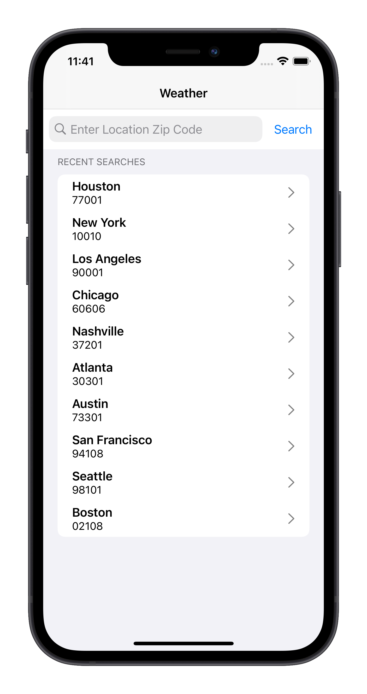
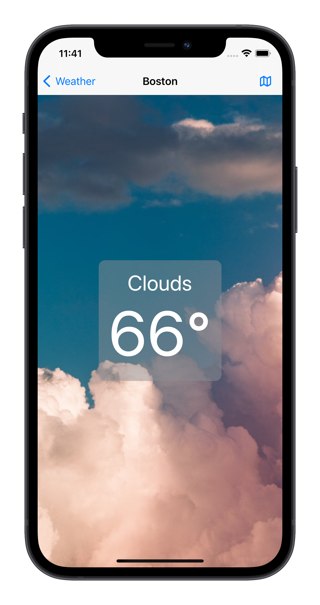

# Lasso+SwiftUI Example Weather App

## Overview

This is a sample iOS app that demonstrates using Lasso and SwiftUI together.

## Feature Overview

Home Screen |  Detail Screen |  Map Screen            
:--------------------:|:--------------------:|:--------------------:
 |  | 

- [x] Search for weather by zip code
- [x] Search for weather by recent searches
- [x] See temperature and conditions at a valid location
- [x] Upon any error, an alert is presented
- [x] See the location on a map using Apple Maps

## Tutorial

[Coming Soon] Check out the two-part tutorial on building a SwiftUI app with Lasso.

## Requirements

- iOS 14.0+
- Xcode 12.0+

## Installation

1. Clone the repository to your local computer.
2. Confirm that you have [Lasso](https://github.com/ww-tech/lasso) added as a Swift Package dependency. 
3. Register an API key with [OpenWeather&reg;](https://openweathermap.org).
4. Replace `YOUR_API_KEY_HERE` in `WeatherService.swift` (See disclaimer [here](API_DISCLAIMER.txt)).
5. Congratulations, you're all set!  

## Contributing
We love contributions!

If you have a feature in mind, and/or have found a bug, the best thing to do is:

1. Search the issues to see if someone has already brought it up!
2. Create a new issue that explains in detail the improvements you'd like to see.
3. If you have a code change in mind, that's awesome!
    1. Fork the project repository.
    2. Create a branch for your feature change.
    3. Open a pull request!
    
# Author
Charles Pisciotta, iOS Engineering Intern

# License
This project and [Lasso](https://github.com/ww-tech/lasso) are licensed under the Apache-2.0 Open Source license (See [LICENSE](LICENSE)).

You are free to do with this project as you please. We do welcome attribution, and would love to hear from you if you are using Lasso in a project!

# Credit

**Are you interested in joining the WW team?** Check out the [careers page](https://www.weightwatchers.com/us/ww-corporate-careers) to view technology job listings as well as open positions on other teams.

OpenWeather&reg; provides the weather data in this app. WW is not affiliated with or sponsored by OpenWeather, nor is WW a sponsor of OpenWeather. OpenWeather is used exclusively for demonstrative purposes.

Image assets are provided by Pexels. WW is not affiliated with, sponsored by, nor a sponser of Pexels.
